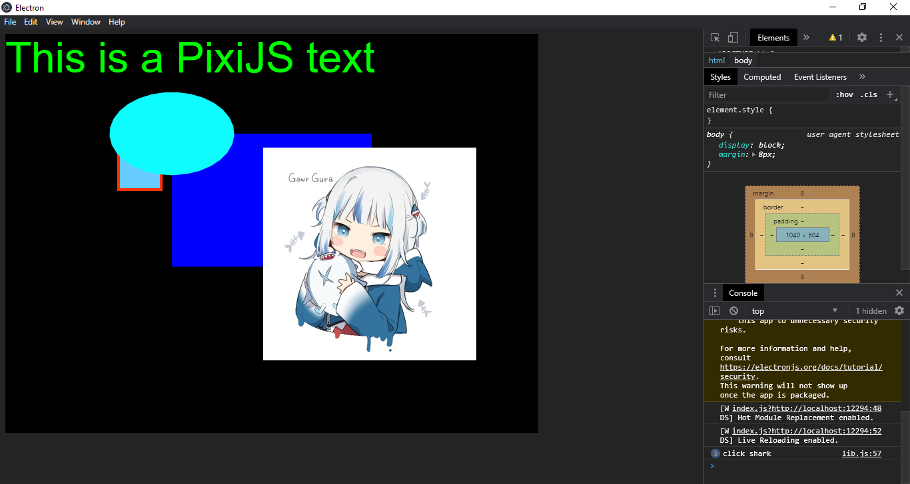
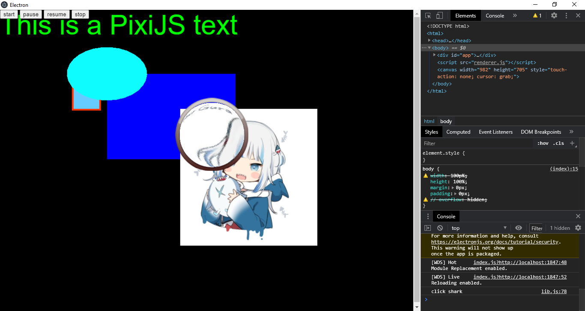

# canvas-pixi-js
electron + pixi.js

### Learn pixijs
* test pixijs function 1 | [20201030](doc/20201030.md)
  * PIXI.Application options, members.
  * PIXI.Renderer | PIXI.CanvasRenderer members.
  * PIXI.utils members.
  * PIXI.Text options.
  * PIXI.TextStyle options.
  * PIXI.Container methods.
  * PIXI.Graphics methods.
  * PIXI.Sprite members, methods.
  * PIXI.Texture members, methods, and events.
  * PIXI.ObservablePoint methods.
  * PIXI.InteractionEvent methods.
  * PIXI.InteractionData methods.
  * PIXI.Point members.
  * Modify README.md.
  * Add img.png.

* test pixijs function 2 | [20201101](doc/20201101.md)
  * Add device, media
  * PIXI.Application -> forceCanvas.
  * PIXI.Renderer -> resize.
  * Collision
    * PIXI.Application -> ticker.
    * PIXI.Ticker methods.
  * Blur
    * PIXI.filters.BlurFilter -> blur.
    * PIXI.Sprite -> filters.
  * Color Matrix
    * PIXI.filters.ColorMatrixFilter.
  * Magnifying glass
    * PIXI.filters.DisplacementFilter.
    * PIXI.Sprite -> filters, anchor.
    * PIXI.Application -> stage -> filters.
    * PIXI.InteractionEvent -> data(PIXI.InteractionData).
    * PIXI.InteractionData -> global -> x/y.
    * PIXI.Sprite -> position(PIXI.ObservablePoint).
    * PIXI.ObservablePoint -> copyFrom method.
    * Modify src/main/index.js, src/renderer/index.js, and src/renderer/lib.js.
    * Add device.js, deviceInfo.js, global.js, and media.js.
    * Add Diamond.jpg, bunny.png, displace.png, and ring.png.
    * Add test.webm
    * Modify README.md.
    * Add 20201030.md, 20201101.md.
    * Add img1.png.


### Getting Started

Install [yarn](https://yarnpkg.com/getting-started/install)
```bash
# copy template git clone
git clone https://github.com/Canvas-pixi-js/canvas-pixi-js.git
cd canvas-pixi-js

# install dependencies
yarn
```

### Development Scripts

```bash
# run application in development mode
yarn dev

# compile source code and create webpack output
yarn compile

# `yarn compile` & create build with electron-builder
yarn dist

# `yarn compile` & create unpacked build with electron-builder
yarn dist:dir
```