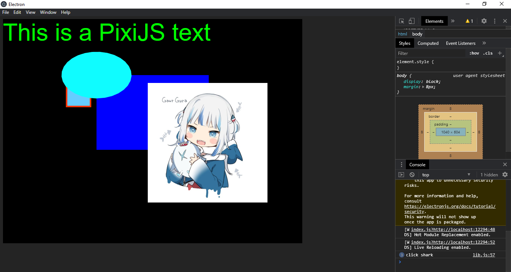

# test pixijs function 1 | [back](../README.md)

### Image

<br><br>
### PIXI
* [PIXI.Application](http://pixijs.download/release/docs/PIXI.Application.html) (options: object) ★import 'pixi.js'
  * options: object (optional)
    * background: number (default: 0x000000)
    * antialias: bool (default: false)
    * transparent: bool (default: false)
  * Members
    * [renderer](http://pixijs.download/release/docs/PIXI.Application.html#renderer): PIXI.Renderer | PIXI.CanvasRenderer
    * [stage](http://pixijs.download/release/docs/PIXI.Application.html#stage): PIXI.Container
    * [view](http://pixijs.download/release/docs/PIXI.Application.html#view): HTMLCanvasElement
* [PIXI.Renderer](http://pixijs.download/release/docs/PIXI.Renderer.html) (WebGL)
  * Members
    * [type](http://pixijs.download/release/docs/PIXI.Renderer.html#type): number (default: [PIXI.RENDERER_TYPE](#PIXI.RENDERER_TYPE).UNKNOWN)
* [PIXI.CanvasRenderer](http://pixijs.download/release/docs/PIXI.CanvasRenderer.html) (No WebGL)
  * Members
    * [type](http://pixijs.download/release/docs/PIXI.CanvasRenderer.html#type): number (default: [PIXI.RENDERER_TYPE](#PIXI.RENDERER_TYPE)
* #### [PIXI.RENDERER_TYPE](http://pixijs.download/release/docs/PIXI.html#.RENDERER_TYPE)
  * UNKNOWN -> 2
  * WEBGL -> 1
  * CANVAS -> 0
* [PIXI.utils](http://pixijs.download/release/docs/PIXI.utils.html)
  * Methods
    * [isWebGLSupported](http://pixijs.download/release/docs/PIXI.utils.html#.isWebGLSupported)(): bool
* [PIXI.Text](http://pixijs.download/release/docs/PIXI.Text.html) (text, style, canvas)
  * (text, style, canvas)
    * [text](http://pixijs.download/release/docs/PIXI.Text.html#text): string
    * [style](http://pixijs.download/release/docs/PIXI.Text.html#style): object | PIXI.TextStyle
* [PIXI.TextStyle](http://pixijs.download/release/docs/PIXI.TextStyle.html) (style)
  * (style)
    * [fontFamily](http://pixijs.download/release/docs/PIXI.TextStyle.html#fontFamily): string | Array<string> (default: Arial)
    * [fontSize](http://pixijs.download/release/docs/PIXI.TextStyle.html#fontSize): number | string (default: 26)
    * [fill](http://pixijs.download/release/docs/PIXI.TextStyle.html#fill): string | Array<string> | number | Array<number> | CanvasGradient | CanvasPattern (default: black)
      * [align](http://pixijs.download/release/docs/PIXI.TextStyle.html#align): string (default: 'left')
* [PIXI.Container](http://pixijs.download/release/docs/PIXI.Container.html)
  * Methods
    * [addChild](http://pixijs.download/release/docs/PIXI.Container.html#addChild) (children): PIXI.DisplayObject
      * children: PIXI.DisplayObject
* [PIXI.Graphics](http://pixijs.download/release/docs/PIXI.Graphics.html)
  * Methods
    * [lineStyle](http://pixijs.download/release/docs/PIXI.Graphics.html#lineStyle) (width, color, alpha, alignment, native)|(options): PIXI.Graphics
      * options
        * width: number (default: 0)
        * color: number (default: 0x0)
        * alpha: number (default: 0.5)
        * alignment: number (default: 0.5)
        * native: boolean	(default: false)
        * cap: PIXI.LINE_CAP (default: PIXI.LINE_CAP.BUTT)
        * join: PIXI.LINE_JOIN (default: PIXI.LINE_JOIN.MITER)
        * miterLimit: number	10
    * [beginFill](http://pixijs.download/release/docs/PIXI.Graphics.html#beginFill) (color, alpha): PIXI.Graphics
      * color: number (default: 0)
      * alpha: number (default: 1)
    * [drawRect](http://pixijs.download/release/docs/PIXI.Graphics.html#drawRect) (x, y, width, height): PIXI.Graphics
      * x: number
      * y: number
      * width: number
      * height: number
    * [endFill](http://pixijs.download/release/docs/PIXI.Graphics.html#endFill) (): PIXI.Graphics
* [PIXI.Sprite](http://pixijs.download/release/docs/PIXI.Sprite.html)
  * Members
    * [x](http://pixijs.download/release/docs/PIXI.Sprite.html#x): number
    * [y](http://pixijs.download/release/docs/PIXI.Sprite.html#y): number
    * [width](http://pixijs.download/release/docs/PIXI.Sprite.html#width): number
    * [height](http://pixijs.download/release/docs/PIXI.Sprite.html#height): number
    * [tint](http://pixijs.download/release/docs/PIXI.Sprite.html#tint): number (default: 0xFFFFFF)
    * [scale](http://pixijs.download/release/docs/PIXI.Sprite.html#scale): PIXI.ObservablePoint
    * [alpha](http://pixijs.download/release/docs/PIXI.Sprite.html#alpha): number
    * [position](http://pixijs.download/release/docs/PIXI.Sprite.html#position): PIXI.ObservablePoint
    * [rotation](http://pixijs.download/release/docs/PIXI.Sprite.html#rotation): number
    * [visible](http://pixijs.download/release/docs/PIXI.Sprite.html#visible): boolean
  * Methods
    * [from](http://pixijs.download/release/docs/PIXI.Sprite.html#.from) (source, options): PIXI.Sprite
      * source: string | PIXI.Texture | HTMLCanvasElement | HTMLVideoElement
* [PIXI.Texture](http://pixijs.download/release/docs/PIXI.Texture.html) (baseTexture, frame, orig, trim, rotate, anchor)
  * (baseTexture, frame, orig, trim, rotate, anchor)
    * baseTexture: PIXI.BaseTexture
  * Members
    * [WHITE](http://pixijs.download/release/docs/PIXI.Texture.html#.WHITE): PIXI.Texture
  * Events ( .on('eventName', (event) => {}); )
    * [click](http://pixijs.download/release/docs/PIXI.Sprite.html#event:click)
    * [mousedown](http://pixijs.download/release/docs/PIXI.Sprite.html#event:mousedown)
    * [touchstart](http://pixijs.download/release/docs/PIXI.Sprite.html#event:mousedown)
    * [mouseup](http://pixijs.download/release/docs/PIXI.Sprite.html#event:mouseup)
    * [mouseupoutside](http://pixijs.download/release/docs/PIXI.Sprite.html#event:mouseupoutside)
    * [touchend](http://pixijs.download/release/docs/PIXI.Sprite.html#event:touchend)
    * [touchendoutside](http://pixijs.download/release/docs/PIXI.Sprite.html#event:touchendoutside)
    * [mousemove](http://pixijs.download/release/docs/PIXI.Sprite.html#event:mousemove)
    * [touchmove](http://pixijs.download/release/docs/PIXI.Sprite.html#event:touchmove)
      * event: [PIXI.interactionEvent](#PIXI.InteractionEvent)
* #### [PIXI.ObservablePoint](http://pixijs.download/release/docs/PIXI.ObservablePoint.html) (cb, scope, x, y)
  * (cb, scope, x, y)
  * Methods
    * [set](http://pixijs.download/release/docs/PIXI.ObservablePoint.html#set) (x, y): this
      * x: number (default: 0)
      * y: number (default: x)
* #### [PIXI.InteractionEvent](http://pixijs.download/release/docs/PIXI.InteractionEvent.html)
  * Members
    * data: [PIXI.InteractionData](#PIXI.InteractionData)
* #### PIXI.InteractionData
  * Methods
    * getLocalPosition (displayObject, point, globalPos): [PIXI.Point](#PIXI.Point)
* #### PIXI.Point (x, y)
  * [x](http://pixijs.download/release/docs/PIXI.Point.html#x)
  * [y](http://pixijs.download/release/docs/PIXI.Point.html#y)
<br><br>
### Code
```javascript
// import PixiJS
import * as PIXI from 'pixi.js'

// create app (default WebGL)
const app = new PIXI.Application({
    //backgroundColor: '0x000000', // 背景顏色
    antialias: true, // 反鋸齒
    transparent: false // 透明
});

// app.view: HTMLCanvasElement
document.body.appendChild(app.view);

const rendererType = ["CANAVAS", "WEBGL", "UNKNOWN"]

console.log("isWebGLSupported:" + PIXI.utils.isWebGLSupported());
console.log("app.renderer.type:" + rendererType[app.renderer.type]);

// PIXI Text
let text = new PIXI.Text('This is a PixiJS text',
    {
        fontFamily: 'Arial',
        fontSize: 64,
        fill: "#00ff00",
        align: 'center'
    }
);
app.stage.addChild(text)

// PIXI rectangle
let rectangle = new PIXI.Graphics();
rectangle.lineStyle(4, 0xFF3300, 1);
rectangle.beginFill(0x66CCFF);
rectangle.drawRect(0, 0, 64, 64);
rectangle.endFill();
rectangle.x = 170;
rectangle.y = 170;
app.stage.addChild(rectangle);

// PIXI rectangle
const r = PIXI.Sprite.from(PIXI.Texture.WHITE);
r.x = 250;
r.y = 150;
r.width = 300;
r.height = 200;
r.tint = 0x0000FF;
app.stage.addChild(r);

// shark image test🦈
const shark = PIXI.Sprite.from("./shark01.jpg") // static/xxx.png
shark.scale.set(0.5, 0.5);
shark.interactive = true;
shark.cursor = 'grab';
shark.visible = true;
// hitArea
// shark.hitArea = new PIXI.Rectangle(100, 100, shark.parent.width / 2, shark.parent.height / 2);
app.stage.addChild(shark);

// event
shark.on('click', (event) => {
    // alert('click shark');
    console.log('click shark');
});

shark.on('mousedown', onDragStart)
    .on('touchstart', onDragStart)
    // events for drag end
    .on('mouseup', onDragEnd)
    .on('mouseupoutside', onDragEnd)
    .on('touchend', onDragEnd)
    .on('touchendoutside', onDragEnd)
    // events for drag move
    .on('mousemove', onDragMove)
    .on('touchmove', onDragMove)

function onDragStart(event) {
    // store a reference to the data
    // the reason for this is because of multitouch
    // we want to track the movement of this particular touch
    this.data = event.data;
    this.alpha = 0.5;
    this.dragging = true;
}

function onDragEnd() {
    this.alpha = 1;
    this.dragging = false;
    // set the interaction data to null
    this.data = null;
}

function onDragMove() {
    if (this.dragging) {
        var newPosition = this.data.getLocalPosition(this.parent);
        this.position.x = newPosition.x;
        this.position.y = newPosition.y;
    }
}

/*app.ticker.add((delta) => {
    shark.rotation += 0.5 * delta;
});*/

// create circle
let circle = new PIXI.Graphics();
circle.beginFill(0xffCFF, 1);
circle.drawCircle(0, 0, 5); // x y r
circle.endFill();
r.addChild(circle);

// app.stage.addChild(circle);

// create star
/* let star = new PIXI.Graphics();
star.beginFill(0xffCFF, 0.5);
star.drawStar(app.view.width / 2, app.view.height / 2, 60);
star.endFill();
app.stage.addChild(star); */

// shark.visible = false;


// shark gif test🦈
const g_shark = PIXI.Sprite.from("tenor.gif") // static/xxx.png
g_shark.scale.set(0.5, 0.5);
g_shark.visible = true;
// app.stage.addChild(g_shark); 
```